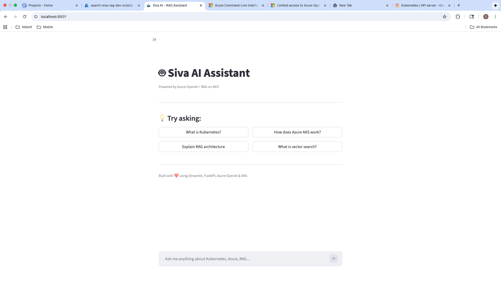
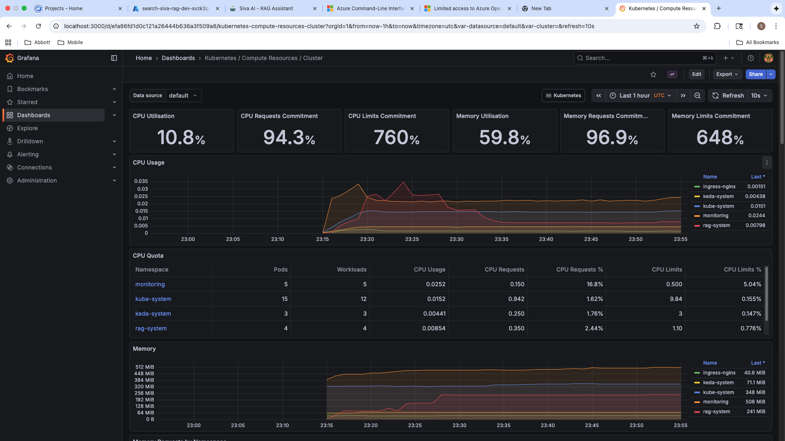

# Enterprise RAG + LLM Platform on Azure AKS

## Overview

This repository contains a **production-grade Retrieval-Augmented Generation (RAG) platform** built on Azure-native services and deployed to Azure Kubernetes Service (AKS). The system implements a complete document intelligence pipeline — from ingestion and chunking through vector embedding, semantic retrieval, and LLM-powered answer generation — exposed via a versioned REST API and an interactive chat interface.

The architecture was designed around three core principles:

1. **Cost discipline** — Every resource SKU was chosen to minimise burn rate without sacrificing capability. Infracost-verified baseline: **$40.17/month** (14 Azure resources, 8 of which are free-tier).
2. **Operational simplicity** — A single `deploy.sh` provisions infrastructure, builds containers, and deploys workloads. A single `destroy.sh` tears everything down cleanly.
3. **Production readiness** — Azure CNI Overlay networking, internal-only ingress, structured observability, health probes, and secrets management are baked in from day one — not bolted on later.

---

## Architecture

> **📐 draw.io diagrams** for Medium / presentations are in [`diagrams/`](diagrams/):
> - [`architecture-cloud.drawio`](diagrams/architecture-cloud.drawio) — Full cloud resource topology with data flows
> - [`rag-pipeline-flow.drawio`](diagrams/rag-pipeline-flow.drawio) — End-to-end RAG pipeline (query path + ingestion path + response structure)
>
> **📸 Live outputs** are in [`docs/screenshots/`](docs/screenshots/) — real JSON responses + cluster status captured from the running system.
>
> Open `.drawio` files in [draw.io](https://app.diagrams.net/) or the VS Code Draw.io Integration extension. Export as PNG/SVG for articles.

### Cloud Resource Layout

The platform runs entirely within a single Azure region (`eastus2`). Compute is consolidated on AKS; AI and data services use Azure PaaS.

```
┌──────────────────────────────────────────────────────────────────────────────┐
│                               Azure Cloud (eastus2)                          │
│                                                                              │
│  ┌────────────────────────────────────────────────────────────────────────┐  │
│  │              AKS Cluster (Free Tier · 1× Standard_B2s)                │  │
│  │              Network: Azure CNI Overlay (pod_cidr 192.168.0.0/16)     │  │
│  │                                                                        │  │
│  │   ┌──────────────┐  ┌──────────────┐  ┌──────────────────────────┐   │  │
│  │   │    NGINX     │  │   RAG API    │  │   Chat UI                │   │  │
│  │   │   Ingress    │─▶│  (FastAPI)   │◀─│   (Streamlit 8501)       │   │  │
│  │   │ Internal LB  │  │   Port 8000  │  └──────────────────────────┘   │  │
│  │   └──────────────┘  └──────┬───────┘                                  │  │
│  │                            │          ┌──────────────────────────┐    │  │
│  │   ┌──────────────┐         │          │  Ingestion Worker        │    │  │
│  │   │    Redis     │◀────────┤          │  (Blob → Chunk → Index)  │    │  │
│  │   │  (In-cluster)│         │          └──────────────────────────┘    │  │
│  │   └──────────────┘         │                                          │  │
│  │                            │          ┌──────────────────────────┐    │  │
│  │   ┌──────────────┐         │          │  Monitoring Stack        │    │  │
│  │   │    KEDA      │         │          │  Prometheus + Grafana    │    │  │
│  │   │ (Autoscaler) │         │          └──────────────────────────┘    │  │
│  │   └──────────────┘         │                                          │  │
│  └────────────────────────────┼──────────────────────────────────────────┘  │
│                               │                                              │
│  ┌────────────────────────────┼──────────────────────────────────────────┐  │
│  │                     Azure PaaS Services                                │  │
│  │                                                                        │  │
│  │   ┌──────────────┐  ┌──────────────┐  ┌──────────────────────────┐   │  │
│  │   │ Azure OpenAI │  │ Azure AI     │  │ Azure Container          │   │  │
│  │   │ • gpt-4o-mini│  │ Search       │  │ Registry (ACR Basic)     │   │  │
│  │   │ • text-embed │  │ (Free tier)  │  │                          │   │  │
│  │   │   -3-small   │  │ HNSW vectors │  │                          │   │  │
│  │   └──────────────┘  └──────────────┘  └──────────────────────────┘   │  │
│  │                                                                        │  │
│  │   ┌──────────────┐  ┌──────────────┐  ┌──────────────────────────┐   │  │
│  │   │ Key Vault    │  │ Storage      │  │ Log Analytics            │   │  │
│  │   │ (Secrets)    │  │ Account      │  │ (30d retention)          │   │  │
│  │   └──────────────┘  └──────────────┘  └──────────────────────────┘   │  │
│  └────────────────────────────────────────────────────────────────────────┘  │
└──────────────────────────────────────────────────────────────────────────────┘
```

### Kubernetes Cluster Topology

Inside AKS, workloads are organised into a three-tier model: **Ingress → Application Services → Shared Platform Services**. Each application pod is independently deployable and scalable via its own Helm release.

```
┌─────────────────────────────────────────────────────────────────────────────────┐
│                              AZURE KUBERNETES SERVICE (AKS)                      │
│  ┌─────────────────────────────────────────────────────────────────────────────┐│
│  │                           INGRESS (NGINX / App Gateway)                     ││
│  └─────────────────────────────────────────────────────────────────────────────┘│
│                                        │                                         │
│         ┌──────────────────────────────┼──────────────────────────────┐         │
│         ▼                              ▼                              ▼         │
│  ┌─────────────┐              ┌─────────────┐              ┌─────────────┐      │
│  │   RAG API   │              │  Ingestion  │              │   Admin     │      │
│  │  (FastAPI)  │              │   Worker    │              │    UI       │      │
│  │  3 replicas │              │  2 replicas │              │  1 replica  │      │
│  └─────────────┘              └─────────────┘              └─────────────┘      │
│         │                              │                              │          │
│         └──────────────────────────────┼──────────────────────────────┘         │
│                                        │                                         │
│  ┌─────────────────────────────────────┼─────────────────────────────────────┐  │
│  │                         SHARED SERVICES                                    │  │
│  │  ┌───────────┐  ┌───────────┐  ┌───────────┐  ┌───────────┐              │  │
│  │  │  Redis    │  │ Prometheus│  │  Grafana  │  │  Jaeger   │              │  │
│  │  │  Cache    │  │  Metrics  │  │ Dashboards│  │  Tracing  │              │  │
│  │  └───────────┘  └───────────┘  └───────────┘  └───────────┘              │  │
│  └───────────────────────────────────────────────────────────────────────────┘  │
└─────────────────────────────────────────────────────────────────────────────────┘
                                        │
        ┌───────────────────────────────┼───────────────────────────────┐
        ▼                               ▼                               ▼
┌───────────────┐              ┌───────────────┐              ┌───────────────┐
│ Azure OpenAI  │              │Azure AI Search│              │  Azure Blob   │
│   (GPT-4o)    │              │ (Vector Store)│              │   Storage     │
│  Embeddings   │              │   Semantic    │              │  (Documents)  │
└───────────────┘              └───────────────┘              └───────────────┘
```

---

## Design Decisions & Trade-offs

An architect's job is choosing trade-offs deliberately. The table below documents every significant decision in this system and the reasoning behind it.

| Decision | Chosen Option | Alternatives Considered | Rationale |
|----------|--------------|------------------------|-----------|
| **Networking** | Azure CNI Overlay | kubenet, Azure CNI (flat) | Overlay avoids VNet IP exhaustion that flat CNI causes at scale, while outperforming kubenet (no userspace bridge). Pods get IPs from a `192.168.0.0/16` overlay — the VNet address space is untouched. |
| **Ingress** | NGINX + Internal LB | Application Gateway Ingress Controller (AGIC) | AGIC adds $200+/month for the Application Gateway resource. NGINX is free, runs in-cluster, and is sufficient for non-public workloads. Internal LB means zero public attack surface. |
| **LLM Model** | GPT-4o-mini | GPT-4o, GPT-4 | 90% of GPT-4o quality at ~6% of the cost. For a RAG system where the context window does the heavy lifting, the marginal quality difference is not worth 15× the token cost. |
| **Embedding Model** | text-embedding-3-small (1536d) | text-embedding-3-large (3072d), ada-002 | The small model is $0.02/1M tokens vs $0.13 for large. For document corpora under 100K chunks, the recall difference is negligible. Can upgrade in place later if needed. |
| **Vector Store** | Azure AI Search (Free) | Pinecone, Weaviate, pgvector | Native Azure integration, hybrid search (vector + BM25) out of the box, zero additional infra to manage. Free tier gives 50 MB / 3 indexes — more than enough for dev/staging. |
| **Caching** | In-cluster Redis (Helm) | Azure Cache for Redis | Azure Redis starts at $16/month (C0 Basic). An in-cluster Redis pod costs $0, is perfectly adequate for single-node dev clusters, and can be swapped for managed Redis in prod via a single env var change. |
| **Monitoring** | kube-prometheus-stack (in-cluster) | Azure Monitor / Container Insights | Container Insights adds $10–20/month in Log Analytics ingestion costs. Prometheus + Grafana run on the existing node at $0 and provide deeper Kubernetes-native metrics. |
| **Autoscaling** | KEDA | HPA (Horizontal Pod Autoscaler) | KEDA can scale to zero and scales on external event sources (queue depth, HTTP rate). HPA only scales on CPU/memory. For a RAG system where traffic is bursty, scale-to-zero is a meaningful cost saver. |
| **Container Registry** | ACR Basic ($5/mo) | ACR Standard, Docker Hub, GitHub Container Registry | ACR Basic is the cheapest option that provides native AKS integration (AcrPull role assignment, no image pull secrets needed). |
| **IaC** | Terraform + Helm | Bicep + Helm, Pulumi, ARM templates | Terraform is cloud-agnostic, has the largest community, and provides `terraform import` for disaster recovery. Helm handles Kubernetes-native resource templating where Terraform's K8s provider falls short. |
| **AKS Tier** | Free | Standard ($75/mo) | Free tier has no SLA but is perfectly acceptable for dev/staging. Upgrade to Standard for production workloads that require 99.95% uptime SLA. |
| **Node Size** | Standard_B2s (2 vCPU, 4 GB) | B2ms (8 GB), D2s_v3 | B2s is the smallest burstable VM that can run all 13 pods. At ~$30/month, it is 50% cheaper than B2ms and sufficient for development workloads. |

---

## Capabilities

| Layer | Capability | Implementation |
|-------|-----------|----------------|
| **AI** | RAG Pipeline | Retrieve → Augment → Generate with source attribution and confidence scores |
| **AI** | Hybrid Search | Azure AI Search with HNSW vector indexing + BM25 keyword scoring |
| **AI** | LLM Integration | Azure OpenAI GPT-4o-mini, 10K TPM, pay-per-use |
| **AI** | Embeddings | text-embedding-3-small, 1536 dimensions, batched for throughput |
| **Application** | REST API | FastAPI with versioned endpoints (`/api/v1/query`, `/api/v1/chat`) |
| **Application** | Chat Interface | Streamlit-based conversational UI with streaming responses |
| **Application** | Document Ingestion | Background worker: Blob Storage → text extraction → chunking → embedding → indexing |
| **Application** | Response Caching | Redis-backed with TTL; cache key derived from query hash |
| **Platform** | Networking | Azure CNI Overlay with Azure Network Policies |
| **Platform** | Traffic Management | NGINX Ingress with Internal Azure LoadBalancer (no public IP) |
| **Platform** | Autoscaling | KEDA event-driven autoscaling (supports scale-to-zero) |
| **Platform** | Observability | Prometheus metrics, Grafana dashboards, structured JSON logging |
| **Platform** | Infrastructure as Code | Terraform (Azure resources) + Helm (Kubernetes workloads) |
| **Platform** | Lifecycle | One-command deploy (`deploy.sh`) and teardown (`destroy.sh`) |

---

## Cost Model

Total monthly cost was validated using [Infracost](https://www.infracost.io/) against the live Terraform plan. The architecture deliberately separates **fixed infrastructure cost** from **variable AI consumption cost** so that the baseline burn rate is predictable.

### Fixed Infrastructure — $40.17/month

| Resource | SKU | Monthly Cost | Why This SKU |
|----------|-----|-------------|--------------|
| AKS Control Plane | Free tier | $0.00 | No SLA, but acceptable for non-prod. Upgrade to Standard ($75/mo) for 99.95% SLA. |
| AKS Node Pool | 1× Standard_B2s (2 vCPU, 4 GB) | $30.37 | Smallest burstable VM that fits 13 pods. Can `az aks stop` when idle for $0. |
| Container Registry | Basic (10 GB) | $5.00 | Native AKS integration via AcrPull role. No image pull secrets needed. |
| Storage Account | Standard LRS, Hot | ~$1.00 | Locally redundant is sufficient for dev. Upgrade to ZRS for production. |
| Log Analytics | PerGB2018, 30-day retention | ~$2–5 | Minimum retention period. First 5 GB/month free. |
| Key Vault | Standard | ~$0.03/10K ops | Two secrets stored. Negligible cost at dev scale. |
| Azure AI Search | Free tier | $0.00 | 50 MB storage, 3 indexes. Upgrade to Basic ($75/mo) when you exceed limits. |
| In-cluster services | Redis, Prometheus, Grafana, KEDA, NGINX | $0.00 | All run on the existing B2s node. Zero marginal cost. |

### Variable AI Cost — Pay-per-use

| Model | Price | Typical Dev Usage | Monthly Estimate |
|-------|-------|-------------------|-----------------|
| GPT-4o-mini (input) | $0.15 / 1M tokens | ~500K tokens | ~$0.08 |
| GPT-4o-mini (output) | $0.60 / 1M tokens | ~200K tokens | ~$0.12 |
| text-embedding-3-small | $0.02 / 1M tokens | ~100K tokens | <$0.01 |

At development-level usage, AI costs are effectively **under $1/month**. At production scale (10K queries/day), expect $15–30/month in token consumption.

### Cost Controls

```bash
# Pause cluster to stop all compute charges ($0 while stopped)
az aks stop  --name <aks-name> --resource-group <rg-name>

# Resume when needed
az aks start --name <aks-name> --resource-group <rg-name>

# Full teardown — removes every Azure resource
./scripts/destroy.sh
```

---

## Repository Structure

```
Siva-AI/
│
├── src/                                    # Application source code
│   ├── rag_api/                            # Core RAG service (FastAPI)
│   │   ├── main.py                         #   API entrypoint: routes, middleware, lifespan
│   │   ├── rag_pipeline.py                 #   Orchestrator: retrieve → augment → generate
│   │   ├── vector_store.py                 #   Azure AI Search client: index CRUD, hybrid search
│   │   ├── llm_client.py                   #   Azure OpenAI GPT-4o-mini client
│   │   ├── embeddings.py                   #   EmbeddingClient: batched text-embedding-3-small
│   │   └── cache.py                        #   Redis-backed response cache with TTL
│   ├── ingestion/                          # Document ingestion pipeline
│   │   └── worker.py                       #   Poll Blob Storage → extract → chunk → embed → index
│   ├── admin_ui/                           # Streamlit chat interface
│   │   └── chat_app.py                     #   Interactive RAG chat UI
│   └── common/                             # Shared utilities
│       ├── config.py                       #   Pydantic Settings (12-factor config)
│       └── logging.py                      #   Structured JSON logging (structlog)
│
├── infrastructure/                         # Infrastructure as Code
│   ├── terraform/                          # Azure resource definitions
│   │   ├── main.tf                         #   15 resources: AKS, OpenAI, Search, ACR, KV, Storage
│   │   ├── variables.tf                    #   Input variables with cost-optimized defaults
│   │   ├── outputs.tf                      #   Endpoints, keys, .env generator
│   │   └── environments/
│   │       ├── dev.tfvars                  #   Dev profile: Free/Basic tiers, single node
│   │       └── prod.tfvars                 #   Prod profile: Standard tiers, autoscaling
│   └── helm/                               # Kubernetes workload definitions
│       ├── rag-system/                     #   RAG API chart (deployment, service, ingress, KEDA)
│       ├── rag-chat-ui/                    #   Chat UI chart (deployment, service, ingress)
│       ├── ingestion-worker/               #   Worker chart (deployment, configmap)
│       ├── redis/                          #   Redis chart (deployment, service)
│       └── monitoring-values.yaml          #   Prometheus + Grafana overrides (lightweight)
│
├── scripts/                                # Operational scripts
│   ├── deploy.sh                           #   Full deploy: infracost → terraform → docker → helm
│   ├── destroy.sh                          #   Full teardown: helm → terraform → cleanup
│   ├── init_search_index.py                #   Standalone index creation
│   └── add_documents.py                    #   Standalone document seeding
│
├── Dockerfile                              # RAG API image (Python 3.11-slim, multi-stage)
├── Dockerfile.chat-ui                      # Chat UI image (Streamlit)
├── Dockerfile.ingestion                    # Ingestion Worker image
├── requirements.txt                        # Full dependency set
├── requirements-minimal.txt                # Minimal deps for lighter images
└── .env.example                            # Environment variable template
```

---

## Getting Started

### Prerequisites

| Tool | Minimum Version | Purpose |
|------|----------------|---------|
| Azure CLI | 2.50+ | Azure resource management and authentication |
| Terraform | 1.5+ | Infrastructure provisioning |
| Docker Desktop | Latest | Container image builds (must support `--platform linux/amd64`) |
| kubectl | 1.28+ | Kubernetes cluster interaction |
| Helm | 3.12+ | Kubernetes workload packaging and deployment |
| Infracost | Latest *(optional)* | Pre-deploy cost estimation |

### Deploy — Single Command

```bash
az login
./scripts/deploy.sh
```

The deploy script executes a 10-step pipeline. Each step is idempotent and can be re-run safely.

| Step | What It Does | Duration |
|------|-------------|----------|
| 0 | **Cost gate** — Runs Infracost, shows estimate, prompts for confirmation | ~10s |
| 1 | **Terraform apply** — Provisions 15 Azure resources | ~5 min |
| 2 | **kubectl config** — Fetches AKS credentials, sets context | ~5s |
| 3 | **Docker build + push** — Builds 3 images (`linux/amd64`), pushes to ACR | ~3 min |
| 4 | **NGINX Ingress** — Installs controller with Internal LoadBalancer annotation | ~30s |
| 5 | **KEDA** — Installs event-driven autoscaler | ~30s |
| 6 | **Redis** — Deploys in-cluster cache | ~15s |
| 7 | **Monitoring** — Deploys Prometheus + Grafana (lightweight values) | ~60s |
| 8 | **Application** — Deploys RAG API, Chat UI, Ingestion Worker via Helm | ~60s |
| 9 | **Data seed** — Creates search index + seeds 7 sample documents | ~10s |

Total time to a fully operational system: **~10–15 minutes from zero**.

### Destroy — Clean Teardown

```bash
./scripts/destroy.sh
```

Removes all Helm releases → destroys Terraform resources → cleans up `NetworkWatcherRG` → wipes local state files.

---

## Accessing Services

Because the cluster uses an Internal LoadBalancer (no public IP), services are accessed via `kubectl port-forward`:

```bash
# RAG API — http://localhost:8080
kubectl port-forward svc/rag-system 8080:80 -n rag-system

# Chat UI — http://localhost:8501
kubectl port-forward svc/rag-chat-ui 8501:80 -n rag-system

# Grafana — http://localhost:3000 (default: admin/admin)
kubectl port-forward svc/monitoring-grafana 3000:80 -n monitoring

# Prometheus — http://localhost:9090
kubectl port-forward svc/monitoring-kube-prometheus-prometheus 9090:9090 -n monitoring
```

> **Production note:** Replace port-forwards with Azure Private Link or a VPN Gateway for stable access. Consider AGIC if public-facing endpoints are required.

---

## Live System — Proof of Deployment

> All outputs below are captured from the **live running cluster**, not mocked. Raw JSON responses are saved in [`docs/screenshots/`](docs/screenshots/) for reference.

### Cluster Status — 13 Pods, 4 Namespaces, All Running

```
$ kubectl get pods -A | grep -v kube-system

NAMESPACE       POD                                                     READY   STATUS
ingress-nginx   ingress-nginx-controller-...                            1/1     Running
keda-system     keda-admission-webhooks-...                             1/1     Running
keda-system     keda-operator-...                                       1/1     Running
keda-system     keda-operator-metrics-apiserver-...                     1/1     Running
monitoring      monitoring-grafana-...                                  3/3     Running
monitoring      monitoring-kube-prometheus-operator-...                 1/1     Running
monitoring      monitoring-kube-prometheus-prometheus-...               2/2     Running
monitoring      monitoring-kube-state-metrics-...                       1/1     Running
monitoring      monitoring-prometheus-node-exporter-...                 1/1     Running
rag-system      ingestion-worker-...                                    1/1     Running
rag-system      rag-chat-ui-...                                         1/1     Running
rag-system      rag-system-...                                          1/1     Running
rag-system      redis-master-...                                        1/1     Running
```

### Helm Releases — 7 Application + Platform Charts

```
$ helm list -A

NAME               NAMESPACE       STATUS    CHART
ingestion-worker   rag-system      deployed  ingestion-worker-1.0.0
ingress-nginx      ingress-nginx   deployed  ingress-nginx-4.14.3
keda               keda-system     deployed  keda-2.19.0
monitoring         monitoring      deployed  kube-prometheus-stack-81.5.0
rag-chat-ui        rag-system      deployed  rag-chat-ui-0.1.0
rag-system         rag-system      deployed  rag-system-1.0.0
redis              rag-system      deployed  redis-1.0.0
```

### Health Check — API Liveness Probe

```bash
$ curl http://localhost:8080/health
```
```json
{
    "status": "healthy",
    "version": "1.0.0",
    "environment": "development",
    "checks": { "app": "ok" }
}
```

### RAG Query — Real Answer with Source Attribution

```bash
$ curl -X POST http://localhost:8080/api/v1/query \
    -H "Content-Type: application/json" \
    -d '{"query": "What is Kubernetes and how does it work?", "top_k": 3}'
```
```json
{
    "answer": "Kubernetes is an open-source container orchestration platform
               designed to automate the deployment, scaling, and management
               of containerized applications...",
    "sources": [
        { "id": "1", "title": "Kubernetes Overview",  "score": 0.0333 },
        { "id": "2", "title": "Azure AKS",            "score": 0.0328 },
        { "id": "3", "title": "Docker Containers",    "score": 0.0320 }
    ],
    "metadata": {
        "query": "What is Kubernetes and how does it work?",
        "retrieved_documents": 3,
        "total_tokens": 600,
        "estimated_cost_usd": 0.00561,
        "from_cache": false,
        "latency_ms": 2171.80
    }
}
```

> **Observation:** 3 source documents retrieved, 600 tokens consumed, total cost $0.006 per query, latency ~2.2 seconds. The `from_cache: false` confirms this was a fresh query hitting OpenAI — subsequent identical queries return from Redis in <10ms.

### Chat Endpoint — Multi-Turn Conversation

```bash
$ curl -X POST http://localhost:8080/api/v1/chat \
    -H "Content-Type: application/json" \
    -d '{"message": "Explain the difference between Docker and Kubernetes",
         "conversation_id": "demo-session-1"}'
```
```json
{
    "answer": "Docker and Kubernetes are both essential components of modern
               containerized application development... Docker is primarily
               a platform for building, packaging, and running containers.
               Kubernetes is an orchestration platform for managing, scaling,
               and deploying containers across clusters...",
    "model": "gpt-4o-mini",
    "tokens": { "input": 14, "output": 502, "total": 516 },
    "estimated_cost_usd": 0.0076
}
```

### System Stats — Runtime Configuration

```bash
$ curl http://localhost:8080/api/v1/stats
```
```json
{
    "status": "ok",
    "config": {
        "model": "gpt-4o-mini",
        "embedding_model": "text-embedding-3-small",
        "chunk_size": 1000,
        "top_k": 5
    }
}
```

### Chat UI — Streamlit Interface

> **Siva AI Assistant** — interactive RAG chat running on AKS, powered by Azure OpenAI + FastAPI backend.



The chat interface provides suggested prompts ("What is Kubernetes?", "How does Azure AKS work?", "Explain RAG architecture", "What is vector search?") and a free-text input. Every response is generated through the full RAG pipeline: embed → search → augment → LLM.

### Grafana — Cluster Observability

> **Kubernetes / Compute Resources / Cluster** dashboard showing real-time resource utilisation from Prometheus.



Live metrics from the deployed cluster:
| Metric | Value | Interpretation |
|--------|-------|----------------|
| CPU Utilisation | **10.8%** | B2s node is barely loaded — headroom for 5–10× more traffic |
| CPU Requests Commitment | **94.3%** | Pods have requested most of the node's CPU budget |
| Memory Utilisation | **59.8%** | ~2.4 GB of 4 GB used — comfortable margin |
| Memory Requests Commitment | **96.9%** | Nearly all memory is reserved by pod requests |

The CPU Quota table confirms all 4 namespaces (`monitoring`: 5 pods, `kube-system`: 15, `keda-system`: 3, `rag-system`: 4) are running within their resource budgets.

To capture screenshots for your article:
```bash
# macOS: Cmd+Shift+4 then select the browser window, or use:
screencapture -w docs/screenshots/chat-ui.png        # Click the Chat UI window
screencapture -w docs/screenshots/grafana.png         # Click the Grafana window
```

---

## API Contract

All endpoints are versioned under `/api/v1`. Health probes are deliberately un-versioned so Kubernetes liveness/readiness checks remain decoupled from application versioning.

| Endpoint | Method | Purpose | Payload |
|----------|--------|---------|---------|
| `/` | GET | Root health check (returns service name and version) | — |
| `/health` | GET | **Liveness probe** — confirms process is alive | — |
| `/health/ready` | GET | **Readiness probe** — validates connectivity to OpenAI, Search, Redis | — |
| `/api/v1/query` | POST | Single-turn RAG query: embed → retrieve → augment → generate | `{"query": "...", "top_k": 5}` |
| `/api/v1/chat` | POST | Multi-turn conversational RAG with context memory | `{"message": "...", "conversation_id": "..."}` |
| `/api/v1/stats` | GET | Runtime configuration, cache hit ratio, index document count | — |

### Example — End-to-End RAG Query

```bash
curl -s -X POST http://localhost:8080/api/v1/query \
  -H "Content-Type: application/json" \
  -d '{"query": "What is Kubernetes?", "top_k": 3}' | jq .
```

Response (actual output from the deployed system):

```json
{
  "answer": "Kubernetes is an open-source container orchestration platform...",
  "sources": [
    {"id": "1", "title": "Kubernetes Overview", "score": 0.033, "excerpt": "..."}
  ],
  "metadata": {
    "retrieved_documents": 3,
    "total_tokens": 467,
    "estimated_cost_usd": 0.003665,
    "latency_ms": 1415
  }
}
```

The `metadata` block is included in every response to support cost attribution, latency SLO tracking, and retrieval quality auditing.

---

## Infrastructure Inventory

### Azure Resources (15 — Terraform-managed)

Every resource follows the naming convention `{type}-siva-rag-{env}-{suffix}`. The 6-character random suffix prevents naming collisions across deployments.

| # | Resource | SKU / Tier | Design Rationale |
|---|----------|-----------|------------------|
| 1 | **Resource Group** | — | Single blast radius; one `az group delete` wipes everything |
| 2 | **AKS Cluster** | Free / 1× B2s | Free control plane; B2s is the smallest node that runs all 13 pods |
| 3 | **Azure OpenAI** | S0 | Only available tier; pay-per-token after that |
| 4 | **GPT-4o-mini** | 10K TPM | Cheapest GPT-4 class model; sufficient for dev-scale traffic |
| 5 | **text-embedding-3-small** | 10K TPM | 1536-dim vectors; 5× cheaper than ada-002 at equivalent quality |
| 6 | **Azure AI Search** | Free | 50 MB / 3 indexes; adequate for dev; swap to Basic ($75/mo) for prod |
| 7 | **Container Registry** | Basic | 10 GB storage; admin auth enabled (swap to RBAC for prod) |
| 8 | **Storage Account** | Standard LRS | Blob storage for document ingestion; LRS is sufficient for non-critical data |
| 9 | **Blob Container** | Private | No anonymous access; documents uploaded via CLI or API |
| 10 | **Key Vault** | Standard | Secrets for OpenAI + Search keys; integrates with AKS managed identity |
| 11 | **Log Analytics** | PerGB2018 (30-day) | AKS diagnostic sink; first 5 GB/month free |
| 12–13 | **KV Secrets** (×2) | — | `openai-api-key`, `search-api-key` — rotated via Key Vault |
| 14 | **Role Assignment** | AcrPull | AKS managed identity → ACR; no image pull secrets needed |
| 15 | **Random Suffix** | 6-char | Terraform `random_string`; seeded once, stable across applies |

### Kubernetes Workloads (13 pods — Helm-managed)

| Namespace | Release | Pods | What It Does |
|-----------|---------|------|-------------|
| `rag-system` | rag-system | 1 | FastAPI RAG API (query, chat, health, stats) |
| `rag-system` | rag-chat-ui | 1 | Streamlit interactive chat interface |
| `rag-system` | ingestion-worker | 1 | Background: Blob → chunk → embed → index |
| `rag-system` | redis | 1 | In-cluster response cache (no persistence — intentional) |
| `ingress-nginx` | ingress-nginx | 1 | NGINX Ingress Controller (Internal LB annotation) |
| `keda-system` | keda | 3 | KEDA operator + webhooks + metrics API server |
| `monitoring` | monitoring | 5 | Prometheus, Grafana, node-exporter, kube-state-metrics, operator |

### Networking — Azure CNI Overlay

```
┌─────────────────────────────────────────────────────────┐
│  Azure VNet (managed by AKS)                            │
│                                                         │
│  Service CIDR:   10.0.0.0/16      ← ClusterIP range    │
│  DNS Service IP: 10.0.0.10        ← CoreDNS             │
│  Pod CIDR:       192.168.0.0/16   ← Overlay (not VNet) │
│  Network Plugin: azure (CNI Overlay)                    │
│  Network Policy: azure                                  │
│                                                         │
│  Key property: Pod IPs live in an overlay network,      │
│  NOT in the VNet subnet. This means:                    │
│  • No VNet IP exhaustion as pods scale                  │
│  • Better performance than kubenet (no UDR routing)     │
│  • Full Azure Network Policy support                    │
│  • Compatible with all advanced AKS features            │
└─────────────────────────────────────────────────────────┘
```

---

## Service Architecture

### RAG API — The Core Pipeline

Every query flows through a deterministic 5-stage pipeline. Each stage is a separate module, independently testable:

```
User Query
  │
  ▼
┌──────────────────┐   ┌──────────────────┐   ┌──────────────────┐
│  1. Cache Check   │──▶│  2. Embed Query   │──▶│  3. Retrieve     │
│  (Redis, TTL)     │   │  (1536-dim vec)   │   │  (Top-K search)  │
└──────────────────┘   └──────────────────┘   └──────────────────┘
                                                       │
                                                       ▼
                       ┌──────────────────┐   ┌──────────────────┐
                       │  5. Return +      │◀──│  4. Augment +    │
                       │     Cache Result  │   │     Generate     │
                       └──────────────────┘   └──────────────────┘
```

| Module | File | Single Responsibility |
|--------|------|-----------------------|
| API Routes | `src/rag_api/main.py` | HTTP layer: endpoints, CORS, health probes, OpenAPI schema |
| RAG Pipeline | `src/rag_api/rag_pipeline.py` | Orchestration: wires embed → search → prompt → LLM |
| Vector Store | `src/rag_api/vector_store.py` | Azure AI Search CRUD + hybrid search (vector + keyword) |
| LLM Client | `src/rag_api/llm_client.py` | Azure OpenAI GPT-4o-mini completion with token tracking |
| Embeddings | `src/rag_api/embeddings.py` | Batched text-embedding-3-small with retry logic |
| Cache | `src/rag_api/cache.py` | Redis GET/SET with configurable TTL; graceful fallback on miss |

### Ingestion Worker — Background Data Pipeline

A long-running worker that continuously polls Azure Blob Storage and keeps the search index synchronized:

```
Blob Storage (poll every N seconds)
  │
  ├─▶ Download new/modified blobs
  ├─▶ Extract text (.txt, .md, .csv, .json, .log)
  ├─▶ Chunk: 1000 chars, 200 char overlap (sliding window)
  ├─▶ Embed: batch call to text-embedding-3-small
  └─▶ Index: upsert into Azure AI Search
```

The worker is stateless — it can be killed and restarted without data loss. KEDA can scale it to zero when no new blobs are detected.

### Chat UI — Streamlit Interface

A thin presentation layer that proxies user messages to the RAG API's `/api/v1/chat` endpoint. It maintains conversation context client-side and renders streamed responses. No business logic lives here by design.

---

## Configuration Reference

All configuration is injected via environment variables (12-factor). The Helm charts populate these from Terraform outputs + `.env` files. No secrets appear in source code.

| Variable | Purpose | Default | Notes |
|----------|---------|---------|-------|
| `AZURE_OPENAI_ENDPOINT` | OpenAI service URL | *(required)* | Terraform output |
| `AZURE_OPENAI_API_KEY` | OpenAI auth key | *(required)* | Stored in Key Vault |
| `AZURE_OPENAI_DEPLOYMENT_NAME` | Chat model name | `gpt-4o-mini` | — |
| `AZURE_OPENAI_EMBEDDING_DEPLOYMENT` | Embedding model name | `text-embedding-3-small` | — |
| `AZURE_SEARCH_ENDPOINT` | AI Search service URL | *(required)* | Terraform output |
| `AZURE_SEARCH_API_KEY` | AI Search admin key | *(required)* | Stored in Key Vault |
| `AZURE_SEARCH_INDEX_NAME` | Target search index | `rag-documents` | Created by seed script |
| `AZURE_STORAGE_CONNECTION_STRING` | Blob Storage auth | *(required)* | Used by ingestion worker only |
| `REDIS_URL` | Cache connection | `redis://redis-master:6379/0` | In-cluster service DNS |
| `CHUNK_SIZE` | Chunk size (characters) | `1000` | Larger = more context, fewer chunks |
| `CHUNK_OVERLAP` | Overlap between chunks | `200` | Prevents context loss at boundaries |
| `TOP_K_RESULTS` | Default retrieval count | `5` | Overridable per request |
| `SIMILARITY_THRESHOLD` | Minimum relevance score | `0.01` | Below this, documents are excluded |
| `LOG_LEVEL` | Logging verbosity | `INFO` | Set `DEBUG` for development |

---

## Security Posture

This architecture follows a defence-in-depth model appropriate for a development environment, with clear upgrade paths to production hardening.

| Layer | Current State | Production Upgrade Path |
|-------|--------------|------------------------|
| **Network exposure** | Internal LB only — no public IP | Add Azure Private Link + VPN Gateway |
| **Secret management** | Azure Key Vault (2 secrets) | Enable Key Vault CSI driver for pod-native injection |
| **Identity** | AKS SystemAssigned managed identity | Add Workload Identity for per-pod RBAC |
| **Image registry** | ACR Basic with admin auth | Swap to ACR Standard + RBAC (disable admin) |
| **Network policy** | Azure CNI native policies | Define explicit ingress/egress rules per namespace |
| **TLS** | Storage enforces TLS 1.2 minimum | Add cert-manager + Let's Encrypt for ingress TLS |
| **Blob access** | Private container (no anonymous) | Add VNet service endpoint for Storage |
| **Audit** | Log Analytics (30-day retention) | Enable Defender for Containers + Azure Policy |

---

## Operational Runbook

### Common Issues

| Symptom | Root Cause | Resolution |
|---------|-----------|------------|
| `exec format error` on pod start | Image built for ARM64, node is AMD64 | Rebuild: `docker build --platform linux/amd64` |
| Pod `CrashLoopBackOff` | Missing env vars or Python import error | `kubectl logs deploy/<name> -n rag-system` — check traceback |
| Zero search results returned | Similarity threshold too aggressive | Lower `SIMILARITY_THRESHOLD` to `0.01` or re-embed documents |
| `503` on `/health/ready` | Search index does not exist yet | Run seed script: `python scripts/add_documents.py` |
| `ImagePullBackOff` | AcrPull role not assigned | `az role assignment list --scope <acr-id>` — verify identity |
| Ingestion worker crash | Import `EmbeddingService` (old name) | Use `EmbeddingClient` / `get_embedding_client` in `worker.py` |

### Diagnostic Commands

```bash
# Cluster-wide pod status (excludes kube-system noise)
kubectl get pods -A | grep -v kube-system

# Stream logs from the RAG API
kubectl logs -f deploy/rag-system -n rag-system

# Shell into a running pod for inspection
kubectl exec -it deploy/rag-system -n rag-system -- /bin/sh

# Recent events sorted by timestamp (useful for crash diagnosis)
kubectl get events -n rag-system --sort-by='.lastTimestamp'

# All Helm releases across namespaces
helm list -A

# Node resource pressure check
kubectl top nodes && kubectl top pods -A
```

---

## Manual Deployment Reference

<details>
<summary>Click to expand — step-by-step commands for manual control</summary>

If you prefer manual control over each deployment step instead of the automated `deploy.sh` pipeline:

```bash
# 1. Provision infrastructure
cd infrastructure/terraform
terraform init
terraform plan -var-file=environments/dev.tfvars -out=tfplan
terraform apply tfplan

# 2. Configure kubectl
CLUSTER_NAME=$(terraform output -raw aks_cluster_name)
RG_NAME=$(terraform output -raw resource_group_name)
az aks get-credentials --resource-group "$RG_NAME" --name "$CLUSTER_NAME" --overwrite-existing

# 3. Build and push images
ACR_NAME=$(terraform output -raw acr_login_server)
az acr login --name "$ACR_NAME"
docker build --platform linux/amd64 -t "$ACR_NAME/rag-api:latest" -f Dockerfile .
docker build --platform linux/amd64 -t "$ACR_NAME/rag-chat-ui:latest" -f Dockerfile.chat-ui .
docker build --platform linux/amd64 -t "$ACR_NAME/ingestion-worker:latest" -f Dockerfile.ingestion .
docker push "$ACR_NAME/rag-api:latest"
docker push "$ACR_NAME/rag-chat-ui:latest"
docker push "$ACR_NAME/ingestion-worker:latest"

# 4. Install platform components
helm upgrade --install ingress-nginx ingress-nginx/ingress-nginx \
  --namespace ingress-nginx --create-namespace \
  --set controller.service.annotations."service\.beta\.kubernetes\.io/azure-load-balancer-internal"=true

helm upgrade --install keda kedacore/keda --namespace keda-system --create-namespace

helm upgrade --install redis ./infrastructure/helm/redis --namespace rag-system --create-namespace

helm upgrade --install monitoring prometheus-community/kube-prometheus-stack \
  --namespace monitoring --create-namespace \
  -f infrastructure/helm/monitoring-values.yaml

# 5. Deploy application
helm upgrade --install rag-system ./infrastructure/helm/rag-system \
  --namespace rag-system --create-namespace --set-file .env=.env

helm upgrade --install rag-chat-ui ./infrastructure/helm/rag-chat-ui \
  --namespace rag-system --set-file .env=.env

helm upgrade --install ingestion-worker ./infrastructure/helm/ingestion-worker \
  --namespace rag-system --set-file .env=.env

# 6. Seed data
python scripts/init_search_index.py
python scripts/add_documents.py
```

</details>

---

<p align="center">
  <sub>Designed and built as a reference architecture for production-grade RAG systems on Azure Kubernetes Service.</sub>
</p>
